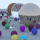

# Ray Tracing



This repository contains a simple ray tracing implementation in Rust. Ray tracing is a technique used in computer graphics to simulate the way light interacts with objects in a scene, producing realistic images.

## Features

- Basic ray tracing algorithm
- Sphere rendering with shading
- Parallel rendering using multiple threads

## Getting Started

### Prerequisites

- A C++ compiler like "GCC" or "CLANG" etc
### Installation

1. Clone the repository:

   ```bash
   git clone https://github.com/carnageiron/raytracing.git
   cd raytracing
   ```

2. Build the project:

   ```bash
   clang main.cc
   ```

3. Run the ray tracer:

   ```bash
   (For Linux Users only): chmod +x  a.out
   ./a.out
   ```

4. Enjoy the rendered image (`output.png`)!

## Configuration

You can adjust various settings in the `main.rs` file, such as image dimensions, camera properties, and scene setup.

## Contributing

Contributions are welcome! If you find any issues or want to enhance the ray tracing implementation, feel free to submit a pull request.

## License

This project is licensed under the [MIT License](LICENSE).

## Acknowledgments

This project was inspired by the fantastic book ["Ray Tracing in One Weekend"](https://raytracing.github.io/books/RayTracingInOneWeekend.html) by Peter Shirley.

---

Feel free to customize this template to better fit your specific project and its features. Don't forget to add your own images, diagrams, and any additional information that would be helpful for users interested in your ray tracing implementation.
